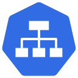

# SQL Server & Kubernetes

---

## What is Kubernetes?

@quote[Kubernetes is a portable, extensible open-source platform for managing containerized workloads and services, that facilitates both declarative configuration and automation. It has a large, rapidly growing ecosystem. Kubernetes services, support, and tools are widely available](kubernetes.io)

---
    
## Kubernetes

 
@size[0.9em](Open source orchestration engine)  
@size[0.9em](Designed by Google)  
@size[0.9em](Hosted by the Cloud Native Computing Foundation)  
@size[0.9em](Kubernetes v1.0 was released on July 21, 2015)

---

# Working locally

---

## Tools

Docker for Desktop 
Visual Studio Code 
Kubectl 
Azure Data Studio

---

# Demo

---

# Kubernetes Concepts

---

## Master

Components for controlling the cluster 

@ul
- @size[0.9em](kube-apiserver) 
- @size[0.9em](etcd) 
- @size[0.9em](kube-scheduler) 
- @size[0.9em](kube-controller-manager) 
- @size[0.9em](cloud-controller-manager) 
@ulend

---

## Nodes

Running and maintaining pods 

@ul
- @size[0.9em](kubelet) 
- @size[0.9em](kube-proxy) 
- @size[0.9em](Docker)
@ulend

---

## Pods

Smallest deployable units of computing 
Group of one or more containers 
Shared storage/network 
Holds specifications of containers

---

## Services

An abstraction over a set of pods 
Provides a stable networking endpoint 
Different types: - 

@ul
- @size[0.9em](ClusterIP) 
- @size[0.9em](NodePort) 
- @size[0.9em](LoadBalancer) 
- @size[0.9em](External Name)
@ul

---?code=assets/code/deployment_yaml_file.yaml&lang=yaml&title=Example yaml file

@[3-4](Metadata of deployment)
@[6](Number of replicas)
@[11-21](Pod declaration)
@[13](Pod name)
@[14](Image to be used)
@[15-16](Port)
@[17-21](Setting environment variables)
@[22-35](Service)
@[24-25](Metadata)
@[27-30](Port on service to port on pod)
@[31-33](External IP address)

---

# Demo

---

# Persisting data

---

## Persisting data

Same issue with Docker containers 
Data changes not on a persistent volume will be lost

---

## Persistent Volumes

Just a piece of storage in the cluster 
Lifecycle independent of the pods 
Can be either dynamic or static

---

## Persistent Volume Claims

Request for storage by a user 
Request for size and access type 
Pods use PersistentVolumeClaims as storage

---?code=assets/code/persistentvolumeclaim.yaml&lang=yaml&title=Persistent Volume yaml file

@[1-8](Create storage class)
@[10-20](Define persistent volume claim)

---?code=assets/code/sqlserver_pvc.yaml&lang=yaml&title=Using Persistent Volume Claims

@[20-24](Referencing secret storing SA PASSWORD)
@[25-31](Reference to PVC)

---

# Demo

---

# Statefulsets

---

### Statefulsets

Designed for stateful applications 
Maintains a "sticky" identity for each pod 
Pods have a persistent identifier 
Used for SQL Server Availability Groups in K8s

---

# Demo

---

# Availability Groups

---

#### https://cloudblogs.microsoft.com/sqlserver/2018/12/10/availability-groups-on-kubernetes-in-sql-server-2019-preview/

---

# Demo